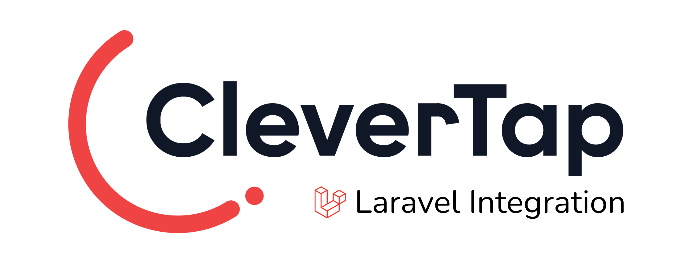

# Laravel CleverTap

A Laravel package for seamless CleverTap API integration.

[](https://packagist.org/packages/bilalbaraz/laravel-clevertap)
[](https://packagist.org/packages/bilalbaraz/laravel-clevertap)


## Installation

You can install the package via composer:

```bash
composer require bilalbaraz/laravel-clevertap
```

## Configuration

T.B.D.

## Basic Usage

T.B.D.

## Advanced Usage

T.B.D.

## Features

T.B.D.

## API Implementation Roadmap

The following CleverTap APIs will be implemented in this package:

- [ ] Catalog API
- [ ] Create Campaign
- [ ] Custom List API
- [ ] Delete User Profile
- [ ] Demerge User Profile
- [ ] External Trigger API
- [ ] Get Campaign Report
- [ ] Get Campaigns
- [ ] Get Event Count
- [ ] Get Events
- [ ] Get Message Reports
- [ ] Get Profile Count
- [ ] Get User Profiles
- [ ] Raise a Bulletin
- [ ] Real-Time Counts
- [ ] Stop Scheduled Campaign
- [ ] Top Property Counts
- [ ] Trends
- [ ] Upload Device Tokens
- [ ] Upload Events
- [ ] Upload User Profiles

## License

The MIT License (MIT). Please see [License](LICENSE.md) for more information.